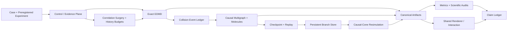

# Molecular Echoes / History-Aware Molecular–Kinetic

> **Reversible and counterfactual hard-sphere animation with collision-history
> graphs, scientifically grounded in the correlations that kinetic closure
> discards.**

[](https://github.com/jandan138/history-aware-molecular-kinetic/actions/workflows/ci.yml)
[](https://github.com/jandan138/history-aware-molecular-kinetic/actions/workflows/docs.yml)

## Current decision

The original paper route tested whether a compact set of collision-history features
could predict where an EDMD–kinetic dynamic LOD should retain exact molecular
identity. The internal `PHASE1-HISTORY-STORY-v0` pilot did **not** support that
operational claim: the tested history features did not improve grouped/OOD
prediction by the preregistered useful margin.

That negative result is preserved. We do not continue directly into
promotion/demotion, online partition control, GPU LOD, or polished old-route Hero
Scenes.

The active first-paper route is now:

> **Molecular Echoes: Reversible and Counterfactual Hard-Sphere Animation with
> Collision-History Graphs**

The project keeps two inseparable tracks:

```text
Scientific Echo Track
  what multi-particle collision information is absent from a resolved f1?

Graphics Time-Machine Track
  how can that history support rewind, branch, edit, and alternate futures?
```

The formal decision is recorded in
[`ADR 0009`](docs/decisions/0009-pivot-to-molecular-echoes-sig.md).

## Core idea

An exact hard-sphere microstate stores:

\[
X(t)=\{x_i(t),v_i(t),\mathrm{id}_i\}_{i=1}^{N}.
\]

A Boltzmann/DSMC description retains a much cheaper one-particle distribution:

\[
f_1(x,v,t),
\]

and intentionally discards detailed multi-particle pairing and collision history.

We construct branches that match a preregistered finite-resolution present:

\[
f_{1,h}^{A}(t_*)\approx f_{1,h}^{B}(t_*),
\]

while carrying different hidden collision correlations. Their futures may then
diverge:

\[
A(t_*+\tau)\neq B(t_*+\tau).
\]

The graphics system turns that hidden structure into an animation representation:

- a timestamped collision causal multigraph;
- deterministic replay and random access;
- causal rewind after particle, collision, or geometry edits;
- persistent counterfactual branches;
- conservative expansion of the affected future cone;
- resolved-state-preserving correlation surgery;
- a history-budget slider based on collision molecules.

## Why the Deng–Hani–Ma result matters

Deng, Hani, and Ma rigorously derive the Boltzmann equation from rarefied Newtonian
hard-sphere dynamics over the lifespan of the Boltzmann solution. Their proof
propagates cumulants that retain complete collision histories and organizes
correlated structures into collision-history molecules before controlling them
with a cutting argument.

This project uses that work as the scientific reason to focus on the information
boundary between:

```text
factorized one-particle kinetic state
vs.
multi-particle correlations carried by collision history
```

The project does **not** claim that:

- the proof's cutting algorithm is an animation algorithm;
- the theorem guarantees our finite-system branch or surgery method;
- a plain Loschmidt echo or velocity reversal is novel;
- matching a discretized `f1_h` means matching the exact microscopic state;
- an event log alone is a new graphics contribution.

## Active SIG contributions

### C1 — Collision-history causal graph

Every collision is a versioned event node linked through particle participation.
The graph preserves repeated events, shared ancestors, collision molecules, branch
lineage, and causal descendants.

### C2 — Causal rewind and counterfactual branching

A user can edit a past particle, collision, aperture, or obstacle. The system
invalidates and recomputes the expanding future causal cone, reusing unaffected
history and falling back to full replay when locality is lost.

### C3 — Resolved-state-preserving correlation surgery

The user can preserve a declared current density/temperature/velocity distribution
while modifying hidden particle–velocity pairing and collision ancestry, producing
alternate futures from the same visible present.

### C4 — Collision-molecule history budget

A structured `(Lambda, Gamma)` intervention tests how much collision-history
connectivity is needed for forward relaxation and reverse echo, with
collision-count-matched and topology-shuffled null controls.

## Active E0–E6 evidence ladder

| Suite | Question |
|---|---|
| **E0** | Are exact EDMD reversal and deterministic replay numerically trustworthy? |
| **E1** | Do exact-reverse and chaotized branches match the declared resolved present yet separate in the future? |
| **E2** | Does a structured collision-molecule budget explain the response beyond collision count? |
| **E3** | Is the causal graph/replay representation correct and queryable? |
| **E4** | Does local causal-cone branching match complete resimulation and provide useful reuse? |
| **E5** | Can correlation surgery preserve the declared present while authoring distinct futures? |
| **E6** | Are the method, interaction, performance, and physical result legible in SIG-quality scenes? |

See [`Active Echo and Branching Benchmark Suite`](docs/benchmarks/echo-branching-suite.md).

The older R0–B5 LOD suite remains in the repository as deferred infrastructure and
an auditable negative-result path. It is not the current paper dependency chain.

## Three Hero Scenes

### Molecular Logo Echo

A passive-color pattern disperses. At the pivot, exact-reverse,
resolved-state-preserving chaotized, DSMC, and history-budget branches look the same
under the declared present audit. Only the history-retaining branch reconstructs
the past pattern.

### One Collision, Two Worlds

The user selects and edits one past collision. Two futures begin almost identically,
then the difference spreads through the collision causal graph. The system shows the
causal cone and verifies the local branch against full resimulation.

### Edit the Past

Inside a transparent molecular maze, the user moves a past obstacle or opens an
aperture. Unaffected history is reused; the expanding future cone is recomputed and
compared with a full global replay.

See [`Hero Scenes`](docs/demos/hero-scenes.md) and the
[`Visual Production Roadmap`](docs/demos/visual-production-roadmap.md).

## Architecture



Detailed architecture:

- [`Architecture overview`](docs/architecture/overview.md)
- [`Collision-history graph and branching`](docs/architecture/collision-history-graph-and-branching.md)

## First target and fallback

The first target is **SIGGRAPH / SIGGRAPH Asia**. The paper must be a graphics and
interactive-techniques contribution: physically recomputed branches, a causal
rewind algorithm, correctness, performance, authoring interaction, and polished 3D
demos—not only a physics phenomenon.

**IEEE VIS** is a deliberate fallback only if the strongest result becomes visual
analytics of collision molecules, branch provenance, causal cones, and hidden
correlations. That route would require linked views, explicit expert analysis tasks,
and a separate evaluation; it is not a renamed SIG draft.

See [`Venue Strategy`](docs/vision/venue-strategy.md).

## Immediate first-stage gate

Before 3D production, the project must complete a short preregistered stage:

1. strict periodic-box reversal at `N=128,256,512`;
2. multi-resolution `f1_h` audit;
3. exact / chaotized / DSMC / ghost branch comparison;
4. structured `(Lambda, Gamma)` budgets;
5. collision-count/time-matched and topology-shuffled controls;
6. one-event causal-branch prototype validated against full resimulation.

See [`Molecular-Echo First Stage`](docs/roadmap/molecular-echo-first-stage.md) and
[`Molecular Echoes Backlog`](docs/roadmap/molecular-echoes-backlog.md).

## Quick start

```bash
python -m pip install -e ".[dev,analysis]"
pytest
python scripts/check_repo.py

cmake -S native -B build/native -DCMAKE_BUILD_TYPE=Release
cmake --build build/native --parallel
ctest --test-dir build/native --output-on-failure
```

The archived Phase-I predictor study remains reproducible:

```bash
PYTHONPATH=src python scripts/run_phase1_story.py \
  --output results/phase1-history-story-v0

PYTHONPATH=src python scripts/evaluate_phase1_story.py \
  results/phase1-history-story-v0/discrepancy-dataset.jsonl \
  --output results/phase1-history-story-v0/evaluation.json
```

It must not be presented as the active SIG method.

## Read first

1. [Research thesis](docs/vision/research-thesis.md)
2. [Collision-History Echoes route](docs/research/collision-history-echo-route.md)
3. [Deng–Hani–Ma connection](docs/research/deng-hard-sphere-connection.md)
4. [Paper positioning](docs/vision/paper-positioning.md)
5. [Venue strategy](docs/vision/venue-strategy.md)
6. [Active benchmark suite](docs/benchmarks/echo-branching-suite.md)
7. [Architecture: graph and branching](docs/architecture/collision-history-graph-and-branching.md)
8. [Milestones](docs/roadmap/milestones.md)
9. [Go/No-Go gates](docs/roadmap/go-no-go-gates.md)
10. [Hero Scenes](docs/demos/hero-scenes.md)
11. [Claim ledger](paper/claim-ledger.md)

## License

Original repository code and documentation are Apache-2.0. External tools retain
their own licenses and are not vendored into this repository.
