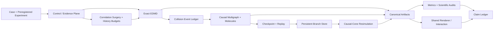

# Molecular Time Machine / History-Aware Molecular–Kinetic

> **Rewind to one past molecular collision, edit it, reuse the untouched history,
> and generate a second exact physical future.**

[](https://github.com/jandan138/history-aware-molecular-kinetic/actions/workflows/ci.yml)
[](https://github.com/jandan138/history-aware-molecular-kinetic/actions/workflows/docs.yml)

## Current decision

The original paper route tested whether a compact set of collision-history features
could predict where an EDMD–kinetic dynamic LOD should retain exact molecular
identity. The internal `PHASE1-HISTORY-STORY-v0` pilot did **not** support that
operational claim: the tested history features did not improve grouped/OOD
prediction by the preregistered useful margin.

That negative result is preserved. We do not continue directly into
promotion/demotion, online partition control, GPU LOD, or polished old-route Hero
Scenes.

The active first-paper route is now:

> **One Collision, Two Worlds: Causal Rewind for Molecular Animation**

The project keeps two inseparable tracks:

```text
Scientific Echo Track
  what multi-particle collision information is absent from a resolved f1?

Graphics Time-Machine Track
  how can that history support rewind, branch, edit, and alternate futures?
```

The initial pivot is recorded in
[`ADR 0009`](docs/decisions/0009-pivot-to-molecular-echoes-sig.md). After E2, the
story-first paper spine is fixed in
[`ADR 0010`](docs/decisions/0010-molecular-time-machine-paper-spine.md).

The first experiment on this route is now complete. The preregistered E1 study
returned `go`: across `N=128,256` and six seeds each, the mean terminal
exact-minus-chaotized color-echo gap is `0.449784`, with a seed-bootstrap 95%
interval of `[0.436573, 0.460660]`. The result is explicitly limited to the frozen
4×2 resolved present; the finer-grid mismatch is disclosed in the
[`E1 Result`](docs/benchmarks/molecular-echoes-e1-result.md).

The preregistered E2 mechanism gate is also complete and returned `stop_e2`. Its
collision-budget ladder is systematic (mean reverse ladder Spearman `0.930574`),
but the dose-selected `(4,0)` molecule does not outperform count/time-matched random
or topology-shuffled controls. The collision-molecule-wiring claim is therefore
closed rather than rescued with more budgets or seeds. See the
[`E2 Result`](docs/benchmarks/molecular-echoes-e2-result.md).

The active route is consequently sharper. E1 is the hook: a frame is not a future.
E2 is the turn: a collision-dose slider is not a causal history. E3 combines the
collision timeline and exact causal branch into the payoff: make one past collision
addressable, edit it, and show two physically recomputed worlds.

E3 is now complete and returned `go`. Rotating collision #2's pair-relative
velocity by one degree changes `33/128` terminal particle positions and lowers the
terminal `E` score from `1.000000` to `0.811782`. The exact causal branch agrees
with all `106` collision pairs in the full resimulation while reusing `79/105`
baseline events; its peak affected set is `33/128` particles. See the
[`E3 Result`](docs/benchmarks/molecular-time-machine-e3-result.md).

## Core idea

An exact hard-sphere microstate stores:

\[
X(t)=\{x_i(t),v_i(t),\mathrm{id}_i\}_{i=1}^{N}.
\]

A Boltzmann/DSMC description retains a much cheaper one-particle distribution:

\[
f_1(x,v,t),
\]

and intentionally discards detailed multi-particle pairing and collision history.

We construct branches that match a preregistered finite-resolution present:

\[
f_{1,h}^{A}(t_*)\approx f_{1,h}^{B}(t_*),
\]

while carrying different hidden collision correlations. Their futures may then
diverge:

\[
A(t_*+\tau)\neq B(t_*+\tau).
\]

The graphics system turns that hidden structure into an animation representation:

- a timestamped collision causal multigraph;
- deterministic replay and random access;
- causal rewind after particle, collision, or geometry edits;
- persistent counterfactual branches;
- conservative expansion of the affected future cone;
- edit manifests and reproducible branch lineage.

## Why the Deng–Hani–Ma result matters

Deng, Hani, and Ma rigorously derive the Boltzmann equation from rarefied Newtonian
hard-sphere dynamics over the lifespan of the Boltzmann solution. Their proof
propagates cumulants that retain complete collision histories and organizes
correlated structures into collision-history molecules before controlling them
with a cutting argument.

This project uses that work as the scientific reason to focus on the information
boundary between:

```text
factorized one-particle kinetic state
vs.
multi-particle correlations carried by collision history
```

The project does **not** claim that:

- the proof's cutting algorithm is an animation algorithm;
- the theorem guarantees our finite-system branch or surgery method;
- a plain Loschmidt echo or velocity reversal is novel;
- matching a discretized `f1_h` means matching the exact microscopic state;
- an event log alone is a new graphics contribution.

## Active SIG contributions

### C1 — Collision-history causal graph

Every collision is a versioned event node linked through particle participation.
The graph preserves repeated events, shared ancestors, collision molecules, branch
lineage, and causal descendants.

### C2 — Causal rewind and counterfactual branching

A user can edit a selected past collision. The system invalidates and recomputes
the expanding future causal cone while reusing events whose two participants remain
unaffected. Geometry edits are a later extension, not part of the first gate.

### Future extension — resolved-state-preserving correlation surgery

The user can preserve a declared current density/temperature/velocity distribution
while modifying hidden particle–velocity pairing and collision ancestry, producing
alternate futures from the same visible present.

### Plot twist / tested boundary — collision-molecule history budget

The `(Lambda, Gamma)` intervention shows graded reverse recovery, but E2-v0's
registered null controls reject the stronger wiring-beyond-dose mechanism. It is a
documented limitation and diagnostic visualization, not an active contribution.

## Active E0–E6 evidence ladder

| Suite | Question |
|---|---|
| **E0** | Are exact EDMD reversal and deterministic replay numerically trustworthy? |
| **E1** | Do exact-reverse and chaotized branches match the declared resolved present yet separate in the future? |
| **E2** | **Closed negative:** budget grades recovery, but structured wiring does not beat dose/topology controls |
| **E3** | Can one addressable past collision fork an exact causal branch that visibly splits and reuses history? |
| **E4** | After the Hero passes, how broadly do locality, performance, and other edit families hold? |
| **E5** | Can correlation surgery preserve the declared present while authoring distinct futures? |
| **E6** | Are the method, interaction, performance, and physical result legible in SIG-quality scenes? |

See [`Active Echo and Branching Benchmark Suite`](docs/benchmarks/echo-branching-suite.md).

The older R0–B5 LOD suite remains in the repository as deferred infrastructure and
an auditable negative-result path. It is not the current paper dependency chain.

## Primary Hero Scene

### Act 1 — Molecular Logo Echo

A passive-color pattern disperses. At the pivot, exact-reverse,
resolved-state-preserving chaotized, and DSMC branches share the declared resolved
present. Exact reversal reconstructs the pattern; E2's budget ladder may be shown
only as a disclosed intervention whose stronger topology claim failed.

### Act 3 — One Collision, Two Worlds

The user selects and edits one past collision. Two futures begin almost identically,
then the difference spreads through the collision causal graph. The system shows the
causal cone and verifies the local branch against full resimulation.

### Future extension — Edit the Past

Inside a transparent molecular maze, the user moves a past obstacle or opens an
aperture. Unaffected history is reused; the expanding future cone is recomputed and
compared with a full global replay.

See [`Hero Scenes`](docs/demos/hero-scenes.md) and the
[`Visual Production Roadmap`](docs/demos/visual-production-roadmap.md).

## Architecture



Detailed architecture:

- [`Architecture overview`](docs/architecture/overview.md)
- [`Collision-history graph and branching`](docs/architecture/collision-history-graph-and-branching.md)

## First target and fallback

The first target is **SIGGRAPH / SIGGRAPH Asia**. The paper must be a graphics and
interactive-techniques contribution: physically recomputed branches, a causal
rewind algorithm, correctness, performance, authoring interaction, and polished 3D
demos—not only a physics phenomenon.

**IEEE VIS** is a deliberate fallback only if the strongest result becomes visual
analytics of collision molecules, branch provenance, causal cones, and hidden
correlations. That route would require linked views, explicit expert analysis tasks,
and a separate evaluation; it is not a renamed SIG draft.

See [`Venue Strategy`](docs/vision/venue-strategy.md).

## First-stage outcome

E1 is complete at `N=128,256`: strict reversal, the resolved-present audit, all
five branches, seed uncertainty, the main figure, and a neutral video pass the
frozen gate. E2 is also complete and closes the molecule-wiring mechanism negative.
The final narrative gate passed:

1. frozen collision #2 was selected in the E1 Hero;
2. its pair-relative velocity was rotated by one degree;
3. exact causal recomputation matched complete resimulation;
4. the world split, `75.238%` history reuse, and `25.781%` causal reach are visible
   in one locked figure and 15.75-second video.

Additional E1/E2 variants and `N=512` are cancelled for this route; they are not a
substitute for the failed mechanism gate.

See [`Molecular-Echo First Stage`](docs/roadmap/molecular-echo-first-stage.md) and
[`Molecular Echoes Backlog`](docs/roadmap/molecular-echoes-backlog.md).

## Quick start

Run the frozen E1 same-resolved-present experiment:

```bash
python -m pip install -e ".[dev,analysis]"
PYTHONPATH=src python scripts/run_echo_e1.py \
  --config configs/studies/molecular-echoes-e1-v0.json \
  --output results/molecular-echoes-e1-v0
```

Reproduce the frozen E2 mechanism decision:

```bash
PYTHONPATH=src python scripts/run_echo_e2.py \
  --config configs/studies/molecular-echoes-e2-v0.json \
  --calibration results/molecular-echoes-e2-v0/calibration-dose-only.json \
  --output results/molecular-echoes-e2-v0
```

Run the frozen Molecular Time Machine E3 recipe:

```bash
PYTHONPATH=src python scripts/run_time_machine_e3.py \
  --config configs/studies/molecular-time-machine-e3-v0.json \
  --output results/molecular-time-machine-e3-v0
```

The E3 command writes the collision timeline, edit manifest, causal-cone report,
local/full comparison, compact decision, two-world figure, compressed trajectories,
and neutral MP4 from one immutable protocol.

The frozen result, claim boundary, numerical table, and artifact hashes are recorded
in the [`E1 Result`](docs/benchmarks/molecular-echoes-e1-result.md).

```bash
python -m pip install -e ".[dev,analysis]"
pytest
python scripts/check_repo.py

cmake -S native -B build/native -DCMAKE_BUILD_TYPE=Release
cmake --build build/native --parallel
ctest --test-dir build/native --output-on-failure
```

The archived Phase-I predictor study remains reproducible:

```bash
PYTHONPATH=src python scripts/run_phase1_story.py \
  --output results/phase1-history-story-v0

PYTHONPATH=src python scripts/evaluate_phase1_story.py \
  results/phase1-history-story-v0/discrepancy-dataset.jsonl \
  --output results/phase1-history-story-v0/evaluation.json
```

It must not be presented as the active SIG method.

## Read first

1. [Research thesis](docs/vision/research-thesis.md)
2. [Molecular Time Machine route](docs/research/molecular-time-machine-route.md)
3. [E3 frozen recipe](docs/benchmarks/molecular-time-machine-e3-preregistration.md)
4. [Deng–Hani–Ma connection](docs/research/deng-hard-sphere-connection.md)
5. [Paper positioning](docs/vision/paper-positioning.md)
6. [Venue strategy](docs/vision/venue-strategy.md)
7. [Active benchmark suite](docs/benchmarks/echo-branching-suite.md)
8. [E1 result](docs/benchmarks/molecular-echoes-e1-result.md)
9. [E3 result](docs/benchmarks/molecular-time-machine-e3-result.md)
10. [Architecture: graph and branching](docs/architecture/collision-history-graph-and-branching.md)
11. [Milestones](docs/roadmap/milestones.md)
12. [Go/No-Go gates](docs/roadmap/go-no-go-gates.md)
13. [Hero Scenes](docs/demos/hero-scenes.md)
14. [Claim ledger](paper/claim-ledger.md)

## License

Original repository code and documentation are Apache-2.0. External tools retain
their own licenses and are not vendored into this repository.
