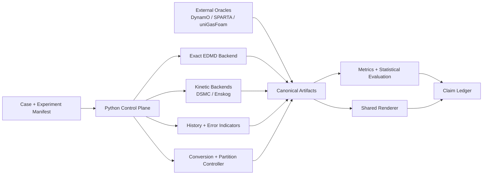

# History-Aware Molecular–Kinetic

> A benchmark-first research platform for **collision-history-aware adaptive hard-sphere and kinetic simulation**.

[](https://github.com/jandan138/history-aware-molecular-kinetic/actions/workflows/ci.yml)
[](https://github.com/jandan138/history-aware-molecular-kinetic/actions/workflows/docs.yml)

**Status:** Phase-I internal 2D reference prototype · exploratory history result
does not support the primary claim · external-oracle validation still pending

## Exploratory Phase-I result

The executable `PHASE1-HISTORY-STORY-v0` study now prepares matched ensembles in
an open channel, a single-baffle channel, and a Correlation Labyrinth, removes
the preparation geometry, and compares EDMD with Boltzmann DSMC in one shared
observation domain across three state families.

The current internal-reference result is negative: exact-history features do not
improve grouped/OOD prediction by the predeclared operational margin. The result
must not be presented as frozen paper evidence until external-oracle validation,
but it blocks dynamic-LOD engineering on the present feature/physics design. See
[`docs/roadmap/phase-1-paper-spine.md`](docs/roadmap/phase-1-paper-spine.md).

## Research question

Can a simulator retain exact hard-sphere identities and collision histories only
where correlations materially affect observable error, while representing the
rest of the domain with a cheaper stochastic kinetic model?

The target runtime decomposition is:

\[
\boxed{
\text{exact hard-sphere dynamics}
\;\rightleftarrows\;
\text{Boltzmann/DSMC or finite-density kinetic representation}
}
\]

The novelty is **not** “EDMD plus DSMC.” Event-driven MD–DSMC hybrids, adaptive
DSMC/continuum methods, and unified particle methods already exist. The research
hypothesis is narrower and falsifiable:

> Collision-history features—after controlling for density, packing fraction,
> Knudsen indicators, non-Maxwellian moments, stress, heat flux, and geometry—may
> provide additional information about where a factorized kinetic description
> loses observable accuracy.

If that hypothesis fails, the project must pivot rather than hide the result.

## Why the hard-sphere result matters—and what it does not imply

Deng, Hani, and Ma rigorously derive the Boltzmann equation from rarefied
Newtonian hard-sphere dynamics over the lifespan of the Boltzmann solution. Their
analysis propagates cumulants that remember full collision histories and controls
associated collision-history molecules with a cutting argument.

This project is inspired by the conceptual boundary between:

- a factorized one-particle kinetic description; and
- multi-particle correlations carried by collision history.

The proof does **not** provide an online refinement indicator, and its cutting
algorithm is not a GPU partitioning algorithm. In the true Boltzmann–Grad regime,
correlations should become small; a history-aware exact region may therefore be
unnecessary. These limitations are first-class benchmark questions, not footnotes.

## Benchmark ladder

| Suite | Purpose | Primary decision |
|---|---|---|
| **R0** | Reproduce DynamO, SPARTA, and uniGasFoam as external references | Are the oracle adapters trustworthy? |
| **B0** | Validate exact EDMD and stochastic kinetic primitives independently | Do our basic solvers preserve their stated invariants? |
| **B1** | Build an EDMD–kinetic discrepancy atlas across regimes and geometry | Where, and in which observables, do models disagree? |
| **B2** | Test incremental predictive value of collision-history features | Does history beat strong state-only baselines on held-out cases? |
| **B3** | Validate exact↔kinetic representation conversion | Can conversion preserve conservation and controlled statistics? |
| **B4** | Evaluate online partitioning, probes, hysteresis, and cost/quality | Is dynamic LOD useful without oracle-only information? |
| **B5** | Produce shared-renderer graphics evidence and hero scenes | Is the contribution visually legible without a demo sinkhole? |

Skipping B2 and going directly to a polished dynamic LOD demo is explicitly
forbidden by the roadmap.

## Architecture



The repository separates:

1. a Python control/evidence plane;
2. a native C++20 and future CUDA/HIP compute plane;
3. process-isolated external oracles;
4. versioned artifact schemas;
5. a renderer that consumes artifacts but never owns physics state.

The coarse backend is intentionally pluggable. Boltzmann DSMC is the first
reference, not a permanent assumption. Finite-density regimes may require Enskog
or another kinetic model.

## Repository map

```text
adapters/       Process/container adapters for external reference solvers
benchmarks/     R0–B5 candidate/frozen benchmark lifecycle
configs/        Reusable presets and schema-valid examples
docs/           Vision, research, architecture, benchmarks, roadmap, ADRs
experiments/    Registered experiment manifests
native/         C++20 semantic boundary and future high-performance kernels
paper/          Claim ledger, evidence matrix, figure/table provenance
references/     Pinned papers, repositories, licenses, and citations
results/        Generated data; ignored by default
schemas/        Versioned scientific artifact contracts
scripts/        Thin repository and experiment utilities
src/            Python control plane and correctness references
tests/          Contracts, graphs, schemas, and repository checks
third_party/    Instructions only; external source checkouts are ignored
```

## First research milestone

The first eight-week spike does **not** attempt a production hybrid solver.
It asks one question:

\[
\boxed{
I(\text{history};\,\text{EDMD--kinetic error}\mid\text{state, geometry}) > 0\;?
}
\]

Operationally, this means comparing held-out predictive performance of:

```text
state-only model:
  density + packing fraction + Kn_GLL + Maxwellian residual
  + stress + heat flux + geometry

history-aware model:
  state-only + repeat/cycle/lineage/C2-proxy features
```

Only a robust out-of-distribution gain unlocks full dynamic LOD development.

## Visual production track

The repository carries a gate-controlled path from canonical artifacts to final SIG/TOG evidence:

```text
V0 artifact replay viewer
→ V1 shared scientific renderer
→ V2 zoom/conversion prototype
→ V3 Expansion-into-Vacuum flagship prototype
→ V4 final three-scene production
→ V5 evidence packaging and release
```

The flagship scene is developed first; Correlation Labyrinth provides the scientific core, and Zoomable Mixing explains conversion and camera/physics independence. Render configs and manifests are versioned so every shot maps back to frozen cases, run IDs, metrics, claims, and input hashes. See [`docs/demos/visual-production-roadmap.md`](docs/demos/visual-production-roadmap.md).

## Quick start

```bash
python -m pip install -e ".[dev,analysis]"
pytest
python scripts/check_repo.py

cmake -S native -B build/native -DCMAKE_BUILD_TYPE=Release
cmake --build build/native --parallel
ctest --test-dir build/native --output-on-failure
```

Run the Phase-I paired study and decision:

```bash
PYTHONPATH=src python scripts/run_phase1_story.py \
  --output results/phase1-history-story-v0

PYTHONPATH=src python scripts/evaluate_phase1_story.py \
  results/phase1-history-story-v0/discrepancy-dataset.jsonl \
  --output results/phase1-history-story-v0/evaluation.json

PYTHONPATH=src python scripts/decide_phase1_story.py \
  --manifest results/phase1-history-story-v0/study-manifest.json \
  --evaluation results/phase1-history-story-v0/evaluation.json \
  --output results/phase1-history-story-v0/decision.json
```

Third-party solvers are not downloaded automatically. Reproduce them through the
adapters after reading [`references/sources.yaml`](references/sources.yaml) and
[`docs/architecture/dependency-and-license-boundaries.md`](docs/architecture/dependency-and-license-boundaries.md).

## Read first

- [从 GAMES103 与流体入门到 History-Aware Molecular–Kinetic Simulation](docs/learning/from-games103-to-history-aware-molecular-kinetic.md)
- [硬球项目研究总览（中文）](docs/research/zh-research-overview.md)
- [Research thesis](docs/vision/research-thesis.md)
- [Deng–Hani–Ma connection and claim boundary](docs/research/deng-hard-sphere-connection.md)
- [Related work](docs/research/related-work.md)
- [Novelty map](docs/research/novelty-map.md)
- [Architecture overview](docs/architecture/overview.md)
- [Benchmark suite](docs/benchmarks/suite.md)
- [Eight-week feasibility spike](docs/roadmap/eight-week-feasibility-spike.md)
- [Go/No-Go gates](docs/roadmap/go-no-go-gates.md)
- [Demo strategy](docs/demos/demo-strategy.md)
- [SIG visual production roadmap](docs/demos/visual-production-roadmap.md)
- [Visual acceptance criteria](docs/demos/visual-acceptance-criteria.md)
- [Hero scene specifications](docs/demos/scene-specs/README.md)
- [Claim ledger](paper/claim-ledger.md)

## License

Original repository code and documentation are Apache-2.0. DynamO, SPARTA,
uniGasFoam, OpenFOAM, and other external tools retain their own licenses and are
not vendored into this repository.
