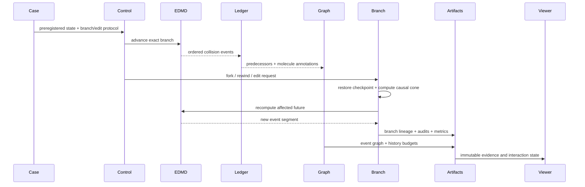

# Architecture Overview

## 1. Active design goal

The architecture now prioritizes **Molecular Echoes**:

- exact hard-sphere dynamics;
- strict reversal and deterministic replay;
- collision causal multigraphs;
- persistent counterfactual branches;
- causal-cone recomputation;
- resolved-state-preserving correlation surgery;
- scientific history-budget interventions;
- reproducible SIG-quality visualization.

The earlier exact↔kinetic dynamic-LOD architecture remains available as deferred
infrastructure, but it is no longer the active first-paper runtime.

## 2. Seven planes

### 2.1 Control and evidence plane

Python owns:

- cases, preregistration, and experiment manifests;
- stable IDs and branch lineage;
- solver orchestration;
- artifact conversion and hashes;
- scientific and graphics metrics;
- claim/evidence indexing;
- external reference adapters.

Python does not own production collision loops.

### 2.2 Exact dynamics plane

C++20 and future accelerated backends own:

- event prediction and invalidation;
- elastic hard-sphere collision resolution;
- deterministic event ordering;
- periodic/analytic boundaries;
- checkpoint state serialization;
- event-output staging.

### 2.3 History graph plane

The history layer owns:

- timestamped collision events;
- particle predecessor/successor links;
- repeated-event multiplicity;
- collision molecule labels and budgets;
- shared ancestors and descendant queries;
- causal-cone extraction;
- event and graph checksums.

### 2.4 Replay and branch plane

The branch engine owns:

- checkpoint policy;
- deterministic segment replay;
- immutable parent branches;
- copy-on-write event/checkpoint sharing;
- edit manifests;
- event invalidation;
- expanding causal-cone resimulation;
- fallback to complete replay.

### 2.5 Scientific intervention plane

This plane owns:

- exact reverse;
- resolved-state-preserving chaotization;
- DSMC/ghost baselines;
- `(Lambda, Gamma)` extended dynamics;
- count/time-matched suppression controls;
- topology-shuffled controls;
- incoming-pair closure readouts;
- multi-resolution pivot audits.

Extended dynamics are never mislabeled as exact EDMD.

### 2.6 Artifact and evidence plane

Every branch emits canonical, versioned artifacts. Metrics, figures, and renderers
read artifacts rather than solver-private memory.

Required active artifact families include:

```text
collision event log
collision causal graph
checkpoint bundle
branch record
edit manifest
causal-cone report
replay audit
resolved-state audit
history-budget report
branch-comparison report
```

### 2.7 Visualization and interaction plane

The shared client displays:

- exact particles and passive color;
- event trails and selected collision nodes;
- causal cones;
- branch timelines and branch trees;
- resolved-state matching diagnostics;
- history-budget response;
- local/full resimulation comparisons.

The renderer cannot change branch physics, event history, or surgery state.

## 3. Active dataflow



## 4. Stable abstractions

The active public semantic API should converge on:

```text
ExactDynamicsBackend
EventLedger
CollisionHistoryGraph
CheckpointStore
BranchStore
CounterfactualEdit
CausalConePolicy
CorrelationSurgery
HistoryBudgetDynamics
Metric / Renderer / InteractionClient
```

These contracts must not assume a single particle-array layout or renderer.

## 5. Determinism contract

Primary exact evidence declares:

- floating-point precision;
- event time tolerance;
- event tie-breaking policy;
- grazing-collision rule;
- boundary wrapping convention;
- checkpoint encoding;
- checksum definition.

A replay divergence produces an artifact and fails the exact claim. Primary
comparisons may not silently snap to logged trajectories.

## 6. Branch ownership

A branch is immutable after freezing. Child branches share parent history until the
fork and own only:

- the edit manifest;
- invalidated history references;
- newly simulated event segments;
- branch-specific checkpoints;
- terminal state and evidence.

The full-copy baseline remains for correctness and storage comparison.

## 7. Causal-cone safety

A local branch may reuse an old trajectory only while independence from the edit is
established. When an affected particle interacts with an unaffected dependency, the
cone expands. When certainty is lost, the method expands or falls back.

The implementation must distinguish:

```text
exact expanding cone
approximate bounded cone
full replay fallback
```

Only the first and third can support exact branch claims.

## 8. Resolved-state surgery firewall

A surgery operator must declare:

- which resolved variables it preserves;
- spatial/velocity resolution;
- moment constraints;
- overlap validity;
- random seed;
- matching algorithm;
- mismatch over finer audits.

The interface may say “same resolved present” only when the registered audit passes.

## 9. External oracles and deferred kinetic route

DynamO remains an exact EDMD reference; SPARTA/DSMC remains a kinetic baseline that
forgets exact pairing; uniGasFoam and Enskog references remain useful for the
archived adaptive-LOD work.

Deferred modules are retained but removed from the active dataflow:

- refinement indicator;
- representation converter;
- partition controller;
- online exact/kinetic region mask.

They may be revived only through a new ADR and evidence gate.

## 10. Camera and evidence firewall

Camera, display density, and graph-overlay choices cannot affect:

- physical branch state;
- surgery transformation;
- causal-cone membership;
- history budget;
- event ordering.

Every primary shot references branch IDs, artifact hashes, camera hashes, and metric
artifacts.

## 11. Extension paths

### SIG production path

Add accelerated EDMD, a responsive branch viewer, and 3D instanced rendering while
preserving active contracts.

### IEEE VIS path

Add linked event-graph, particle-space, velocity-space, branch-tree, and uncertainty
views as an evidence client. The VIS client does not redefine simulation semantics.

### Future adaptive-LOD path

The older exact/kinetic modules can be revisited as a separate project after a new
predictive or error-estimation hypothesis passes.

Detailed semantics are in
[Collision-History Graph, Replay, and Counterfactual Branching](collision-history-graph-and-branching.md).
