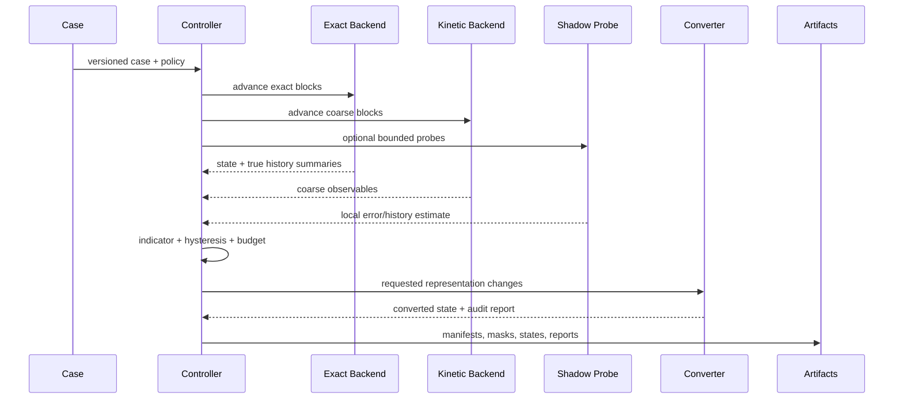

# Architecture overview

## 1. Design goals

The architecture must support a research program that may pivot from Boltzmann
DSMC to Enskog, from dynamic LOD to error estimation, or from hybrid simulation
to collision-history editing without carrying one-off demo assumptions into the
core.

The system is therefore organized around **semantic contracts**, not one solver.

## 2. Five planes

### 2.1 Control plane

Python owns:

- case and experiment manifests;
- stable IDs and provenance;
- external solver orchestration;
- artifact conversion;
- metric evaluation;
- dataset construction;
- statistical evaluation;
- paper evidence indexing.

Python does not own production particle arrays or collision kernels.

### 2.2 Compute plane

C++20 and future CUDA/HIP backends own:

- exact event scheduling and collision resolution;
- DSMC/Enskog transport and collision sampling;
- block-local moments;
- rolling collision-history sketches;
- representation conversion kernels;
- dynamic partition application;
- device-side output staging.

### 2.3 Oracle plane

DynamO, SPARTA, and uniGasFoam are installed separately and invoked through
adapters. Their raw outputs are immutable evidence inputs.

### 2.4 Artifact/evidence plane

All methods emit canonical, versioned artifacts. Metrics and figures read those
artifacts; they do not reach into solver-private memory.

### 2.5 Visualization plane

The shared renderer consumes particle, field, partition, and history artifacts.
It may vary draw density and camera, but it cannot modify the physics partition.

## 3. Runtime dataflow



## 4. Stable abstractions

The public semantic API has six roles:

```text
SolverBackend
OracleAdapter
RefinementIndicator
RepresentationConverter
PartitionController
Metric / Renderer
```

Backends are replaceable. An indicator cannot assume a specific particle array
layout. A renderer cannot assume a specific solver.

## 5. Physical representation registry

The initial registry contains:

- `exact_hard_sphere`;
- `boltzmann_dsmc`;
- `enskog_particle`;
- `shadow_edmd_probe`;
- `unresolved`.

Adding a new representation requires:

1. an ADR;
2. a canonical state artifact;
3. independent B0 validation;
4. declared conversion edges;
5. conservation/statistics contracts;
6. license and provenance review.

## 6. Block ownership

A physical particle belongs to exactly one primary representation at a time.
Interface buffers may contain ghost or duplicated computational samples, but they
must be marked non-owning and excluded from global conservation sums.

This prevents double counting during overlap/blending.

## 7. Observability firewall

Features are separated into:

```text
runtime_observable
shadow_probe
oracle_only
```

The online controller is statically configured with an allowed visibility set.
Evaluation code rejects policies that consume oracle-only features.

## 8. Camera firewall

Physical partition decisions may use visibility only if the paper explicitly
studies perceptual error and logs it as a separate term. Default physics policies
cannot access camera position, screen size, or renderer settings.

Rendering LOD can independently change how many samples are displayed.

## 9. Failure as data

A run status distinguishes:

- metric failure;
- numerical instability;
- adapter failure;
- resource exhaustion;
- invalid input;
- license block;
- model not applicable.

A failed model-regime assumption must never be converted into a generic crash or
silently filtered run.

## 10. Extension paths

### Enskog pivot

Add `enskog_particle`, compare it in B1/B2, and update conversion edges without
changing benchmark or evidence infrastructure.

### Editing/replay pivot

Add collision-DAG and checkpoint artifacts while reusing exact event logs,
provenance, metrics, and renderer.

### Parallel EDMD pivot

Replace the exact backend and preserve the same cases and oracle comparisons.

### Graphics-only visualization experiments

Add render policies under B5 without modifying B0–B4 physics artifacts.
