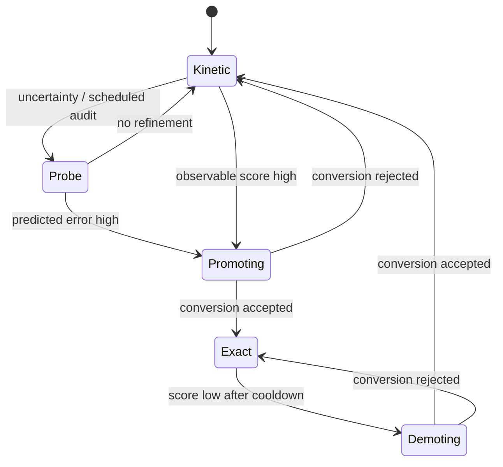

# Runtime state model

## 1. Domain blocks

The domain is partitioned into stable block IDs. A block record contains:

```text
geometry extent
physical owner representation
non-owning interface samples
state summary
history/probe summary
indicator score
cooldown/hysteresis state
conversion state
artifact provenance
```

Block topology may be uniform initially and adaptive later. IDs must survive
short-term repartitioning or include explicit parent/child lineage.

## 2. Exact state

An exact block contains:

- particle ID, species, mass, radius;
- position and velocity;
- next-event metadata;
- boundary ownership;
- rolling true collision events;
- optional checkpoint/replay information.

Particle IDs are physical computational identities within an exact interval.
When particles are demoted, their identity may end. Promotion creates new exact
identities and records their parent coarse artifact.

## 3. Kinetic state

A kinetic block contains:

- weighted superparticles;
- position and velocity;
- species and weight;
- DSMC or Enskog cell metadata;
- collision-model parameters;
- local moment accumulators;
- random-number stream provenance.

A kinetic particle ID is not interpreted as a molecular history lineage.

## 4. State summary

Every block periodically publishes:

\[
(\rho,\phi,u,T,\mathrm{Kn}_{GLL},R_M,\Pi,q,N_s,\ldots).
\]

Definitions, normalization, and sampling windows are fixed by the case and
artifact schema.

## 5. Exact history summary

A rolling exact window may publish:

- total collisions;
- unique collision pairs;
- repeated-pair ratio;
- participating vertices;
- connected components;
- graph circuit rank;
- largest component fraction;
- lineage depth summaries;
- re-encounter times;
- low-dimensional pair/cumulant proxies.

These features are descriptive. Their predictive utility is a B2 question.

## 6. Shadow probes

A probe has:

- source kinetic block and source artifact hash;
- sampled microstate policy;
- exact probe horizon;
- random seed;
- overlap/exclusion initialization method;
- probe cost;
- probe-derived features and uncertainty.

A probe is not allowed to write back physical state unless a promotion is
separately approved and audited.

## 7. Partition state machine



The controller uses separate promote and demote thresholds and a cooldown time.

## 8. Conversion ownership

During conversion, one representation remains the physical owner until the new
state passes conservation and validity checks. Only then does ownership flip.

Rejected conversion leaves the source state unchanged and emits a failure report.

## 9. Global budgets

Global sums include only owning particles/cells. Interface ghosts, renderer
samples, and probe particles are excluded.

The run manifest records:

\[
\Delta M,\quad \Delta P,\quad \Delta E
\]

from solver evolution separately from conversion-induced changes.
