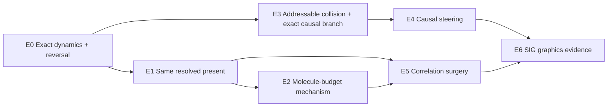

# Active E0–E6 Echo and Branching Benchmark Suite

This suite replaces dynamic molecular LOD as the active first-paper evidence ladder.
The older R0–B5 suite remains available as deferred infrastructure and negative
history.



## E0 — Exact dynamics, numerical reversal, and replay primitives

### Question

Can the internal EDMD reproduce an exact forward/reverse experiment and a recorded
event segment within declared numerical tolerances?

### Cases

- two-disk analytic collision;
- periodic multi-disk gas at `N=128, 256, 512`;
- grazing-collision stress cases;
- near-simultaneous event-order cases;
- checkpoint/random-access replay.

### Evidence

- position/velocity return error;
- event-pair and event-time agreement;
- pre/post checksum agreement;
- invariant drift;
- replay latency versus checkpoint interval.

### Gate

No scientific echo or graphics branching claim proceeds if exact reversal is not
numerically trustworthy.

## E1 — Same resolved present, opposite futures

### Question

Can exact-reverse and chaotized-reverse branches match a preregistered finite
one-particle state while producing robustly different futures?

### Branches

```text
forward exact EDMD
exact reverse EDMD
resolved-state-preserving chaotized reverse EDMD
DSMC from the reversed resolved state
no-collision ghost baseline
```

### Audit

At pivot time, report matching over a grid of:

- spatial block sizes;
- velocity-bin resolutions;
- passive-color partitions;
- one- and two-moment summaries.

The claim is about the declared resolved present `f1_h`; it does not assert identical
exact microstates or continuous `f1`.

### Outputs

- normalized anisotropy/echo response;
- passive-color pattern recovery;
- future branch divergence;
- multi-resolution pivot mismatch;
- seed uncertainty.

## E2 — Collision-molecule budget and mechanism controls

**Result:** complete with `stop_e2`. The registered budget ladder is systematic,
but `(4,0)` does not outperform count/time-matched random or topology-shuffled
controls. The topology-beyond-dose interpretation is closed; see the
[E2 result](molecular-echoes-e2-result.md).

### Question

Does a structured collision-history budget explain echo recovery beyond the trivial
effect of allowing more collisions?

### Dynamics

- full exact EDMD;
- `(Lambda, Gamma)` paths such as `(4,0)`, `(8,0)`, `(16,1)`;
- no-collision ghost dynamics;
- count/time-matched random collision suppression;
- topology-shuffled collision partners.

### Required evidence

- forward and reverse budget-response curves;
- collision count/time distributions;
- incoming-pair closure-defect proxy;
- branch observable error relative to full exact;
- uncertainty across seeds and `N`;
- small fixed-`N epsilon` sequence if the finite-system mechanism passes.

### Gate

A molecule-budget claim fails if random suppression or a collision-count-only model
explains the same response.

## E3 — One addressable collision, two exact worlds

**Result:** complete with `go`. The frozen Hero achieves a `0.188218` terminal
color gap, `106/106` collision-pair agreement, `79/105` baseline-event reuse, and
`33/128` peak affected particles. See the
[E3 result](molecular-time-machine-e3-result.md).

### Question

Can the event multigraph serve as a correct provenance index **and** drive an exact
counterfactual branch after one past-collision edit?

### Cases

- frozen E1 `N=128`, seed `0` exact-reverse Hero;
- collision ordinal `2`, pair `(101,118)`;
- forced checkpoint `1e-6` before contact;
- `+1°` pair-relative-velocity rotation in the center-of-mass frame;
- exact expanding affected set and complete-resimulation reference.

### Evidence

- stable event IDs, causal predecessors, state hashes, and checkpoints;
- local/full collision pair and time agreement;
- terminal position and velocity agreement;
- conserved edit momentum and energy;
- terminal visual split, reused baseline events, and peak affected fraction;
- one locked figure/video manifest.

### Gate

The graph passes only if it performs the branch. The frozen thresholds and artifact
list are in the [E3 recipe](molecular-time-machine-e3-preregistration.md).

## E4 — Causal steering: choose the cause, direct the future

**Result:** complete with `go`. Selecting the upper E stroke leads baseline ancestry
to collision `#4`; the selected `−1°` branch changes `2/4` target particles versus
`1/8` collateral foreground particles, reuses `79/103` events, and agrees with all
`100/100` full-reference collision pairs. See the
[E4 result](molecular-time-machine-e4-result.md).

### Question

Can a creator select a terminal visual feature, use baseline collision ancestry to
find a useful past cause, and browse a small exact counterfactual palette before
saving one verified branch?

### Registered Hero

- same E1 exact-reverse `N=128`, seed `0` world as E3;
- select the nonempty upper horizontal stroke of the recovered E;
- rank the first 16 collisions solely from target-descendant coverage and purity;
- browse `-2°, -1°, +1°, +2°` conservative pair-velocity edits for the top three;
- save one branch and run the one complete-resimulation reference.

### Evidence

- target membership and baseline-only collision ranking;
- cached exact local branch palette and interaction latency;
- target change versus non-target foreground change;
- one saved branch's reuse, causal cone, conservation, and local/full agreement;
- figure, neutral video, browser interaction artifact, and manifests.

### Gate

`go` requires the selected feature to change at least twice as strongly as
collateral E foreground, median exact-preview latency below `0.20 s`, at least 50%
saved-branch event reuse, and one exact local/full reference. If only the target
selectivity fails, the wording narrows from **causal steering** to **causal
exploration**.

The complete frozen contract is in the [E4 recipe](molecular-time-machine-e4-preregistration.md).

No density grid, extra edit family, geometry scene, native rewrite, or user study is
part of this gate.

## E5 — Same Present, Chosen Future

### Question

Can a creator select the future E middle stroke, preserve one declared visible
present, and author a C-like future through a sparse hidden surgery?

### Frozen Hero

- `N=256`, seed `4`, common pivot `t=0.80`;
- target-only velocity transpositions inside the same declared `4×2` cell;
- one or two particle-disjoint swaps;
- 30 complete-EDMD previews;
- deterministic target-removal / collateral-retention selection.

### Evidence

- identical positions, colors, and declared cellwise velocity multisets;
- mass/momentum/energy and geometry contract;
- target-region occupancy and non-target glyph retention;
- matched E-versus-C exact futures;
- cached creator-facing preview palette and surgery provenance.

No random baseline, resolution sweep, seed grid, or additional edit family belongs
to the E5 story gate.

The frozen Hero returns `go`: the selected two-swap surgery touches four of 256
particles, reduces middle-stroke occupancy from 8 to 2, retains all 19 collateral
foreground particles, and preserves the declared current-frame contract. See the
[E5 result](molecular-time-machine-e5-result.md).

## E6 — SIG graphics evidence

### Hero scenes

1. **Molecular Logo Echo** — the same resolved pivot produces recovery or continued
   mixing depending on hidden history;
2. **One Collision, Two Worlds** — one past event forks two futures and the causal
   influence spreads through the event graph;
3. **Choose the Cause, Direct the Future** — a selected terminal feature traces to
   a past collision and opens one scoped exact alternate future.

### Required comparison discipline

- shared camera, renderer, display density, and frame times;
- no backward video used as a substitute for simulated reversal;
- original branch, edited branch, local recomputation, and full-resimulation
  reference linked to frozen runs;
- causal graph and diagnostics explain the physical branch rather than create the
  visual difference;
- every primary shot has a render manifest and quantitative evidence link.

### Primary graphics metrics

- visible echo/branch divergence;
- local-vs-full correctness;
- branch latency and storage;
- causal-cone fraction;
- interactive response time;
- temporal continuity;
- reviewer-visible contribution without debug overlays.

## Deferred R0–B5 suite

The following remain valuable but are no longer the active dependency chain:

```text
R0 external oracles
B0 exact/kinetic primitives
B1 discrepancy atlas
B2 history predictor
B3 representation conversion
B4 dynamic LOD
B5 old LOD graphics scenes
```

R0/B0 continue to support solver trust. The Phase-I B2 result remains recorded as an
exploratory negative. B3–B5 are deferred until a future project reopens the LOD
question with new evidence.

## Case lifecycle

```text
candidate -> preregistered -> smoke -> converged -> reviewed -> frozen -> evidence
                                     \-> retired with reason
```

A preregistration commit/tag must precede result generation for E1 and E2 primary
evidence.
