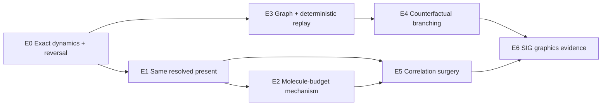

# Active E0–E6 Echo and Branching Benchmark Suite

This suite replaces dynamic molecular LOD as the active first-paper evidence ladder.
The older R0–B5 suite remains available as deferred infrastructure and negative
history.



## E0 — Exact dynamics, numerical reversal, and replay primitives

### Question

Can the internal EDMD reproduce an exact forward/reverse experiment and a recorded
event segment within declared numerical tolerances?

### Cases

- two-disk analytic collision;
- periodic multi-disk gas at `N=128, 256, 512`;
- grazing-collision stress cases;
- near-simultaneous event-order cases;
- checkpoint/random-access replay.

### Evidence

- position/velocity return error;
- event-pair and event-time agreement;
- pre/post checksum agreement;
- invariant drift;
- replay latency versus checkpoint interval.

### Gate

No scientific echo or graphics branching claim proceeds if exact reversal is not
numerically trustworthy.

## E1 — Same resolved present, opposite futures

### Question

Can exact-reverse and chaotized-reverse branches match a preregistered finite
one-particle state while producing robustly different futures?

### Branches

```text
forward exact EDMD
exact reverse EDMD
resolved-state-preserving chaotized reverse EDMD
DSMC from the reversed resolved state
no-collision ghost baseline
```

### Audit

At pivot time, report matching over a grid of:

- spatial block sizes;
- velocity-bin resolutions;
- passive-color partitions;
- one- and two-moment summaries.

The claim is about the declared resolved present `f1_h`; it does not assert identical
exact microstates or continuous `f1`.

### Outputs

- normalized anisotropy/echo response;
- passive-color pattern recovery;
- future branch divergence;
- multi-resolution pivot mismatch;
- seed uncertainty.

## E2 — Collision-molecule budget and mechanism controls

### Question

Does a structured collision-history budget explain echo recovery beyond the trivial
effect of allowing more collisions?

### Dynamics

- full exact EDMD;
- `(Lambda, Gamma)` paths such as `(4,0)`, `(8,0)`, `(16,1)`;
- no-collision ghost dynamics;
- count/time-matched random collision suppression;
- topology-shuffled collision partners.

### Required evidence

- forward and reverse budget-response curves;
- collision count/time distributions;
- incoming-pair closure-defect proxy;
- branch observable error relative to full exact;
- uncertainty across seeds and `N`;
- small fixed-`N epsilon` sequence if the finite-system mechanism passes.

### Gate

A molecule-budget claim fails if random suppression or a collision-count-only model
explains the same response.

## E3 — Collision causal graph and deterministic replay

### Question

Can the event multigraph serve as a correct random-access and provenance index?

### Cases

- particle predecessor/successor queries;
- repeated-pair events;
- shared-ancestor queries;
- checkpoint restore and replay;
- branch lineage and copy-on-write history segments.

### Evidence

- graph reconstruction against the raw event log;
- query correctness;
- replay checksum agreement;
- storage and query costs;
- behavior under event-order ambiguity.

## E4 — Counterfactual branching and causal-cone recomputation

### Question

Can a past edit be recomputed through an expanding causal cone and match a complete
resimulation?

### Edits

1. perturb one particle before a collision;
2. modify/suppress one registered collision under declared semantics;
3. insert, remove, or move a simple obstacle;
4. open/close a simple aperture.

### Baselines

- full resimulation from the checkpoint;
- full state duplication per branch;
- replay-only video editing, which is not physically recomputed;
- approximate fixed-radius local recomputation.

### Evidence

- local-vs-full terminal state/event error;
- affected particle and event fractions over time;
- runtime and storage;
- fallback-to-full frequency;
- scaling with edit age and density.

### Gate

The local algorithm must never claim exactness when it truncates an uncertain cone.
It either expands the cone, marks the result approximate, or falls back to full
replay.

## E5 — Resolved-state-preserving correlation surgery

### Question

Can a user alter hidden correlations while preserving the declared visible present,
and thereby author a different future?

### Operators

- block+color velocity permutation;
- constrained moment matching;
- optional finer-scale assignment minimizing `f1_h` mismatch;
- partial history retention or molecule-targeted surgery.

### Evidence

- multi-resolution resolved-state audit;
- mass/momentum/energy preservation;
- overlap validity;
- branch divergence under the same renderer;
- controllability and repeatability;
- comparison with random surgery of equal magnitude.

## E6 — SIG graphics evidence

### Hero scenes

1. **Molecular Logo Echo** — the same resolved pivot produces recovery or continued
   mixing depending on hidden history;
2. **One Collision, Two Worlds** — one past event forks two futures and the causal
   influence spreads through the event graph;
3. **Edit the Past** — a past geometry edit reuses unaffected history and
   recomputes only the future cone.

### Required comparison discipline

- shared camera, renderer, display density, and frame times;
- no backward video used as a substitute for simulated reversal;
- original branch, edited branch, local recomputation, and full-resimulation
  reference linked to frozen runs;
- causal graph and diagnostics explain the physical branch rather than create the
  visual difference;
- every primary shot has a render manifest and quantitative evidence link.

### Primary graphics metrics

- visible echo/branch divergence;
- local-vs-full correctness;
- branch latency and storage;
- causal-cone fraction;
- interactive response time;
- temporal continuity;
- reviewer-visible contribution without debug overlays.

## Deferred R0–B5 suite

The following remain valuable but are no longer the active dependency chain:

```text
R0 external oracles
B0 exact/kinetic primitives
B1 discrepancy atlas
B2 history predictor
B3 representation conversion
B4 dynamic LOD
B5 old LOD graphics scenes
```

R0/B0 continue to support solver trust. The Phase-I B2 result remains recorded as an
exploratory negative. B3–B5 are deferred until a future project reopens the LOD
question with new evidence.

## Case lifecycle

```text
candidate -> preregistered -> smoke -> converged -> reviewed -> frozen -> evidence
                                     \-> retired with reason
```

A preregistration commit/tag must precede result generation for E1 and E2 primary
evidence.
