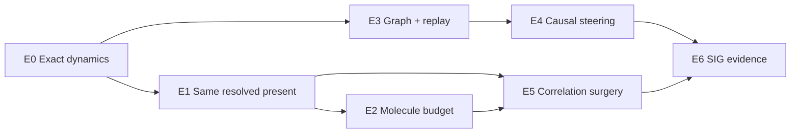

# Benchmark Suite

## 1. Active and deferred ladders

The repository now contains two ladders with different status.

### Active first-paper ladder

```text
E0 exact reversal and replay
→ E1 same resolved present / opposite futures
→ E2 collision-molecule mechanism
→ E3 history graph and deterministic replay
→ E4 causal steering from future target to past collision
→ E5 Same Present, Chosen Future
→ E6 SIG graphics evidence
```

See [Active E0–E6 Echo and Branching Suite](echo-branching-suite.md).

### Deferred adaptive-LOD ladder

```text
R0 external references
→ B0 exact/kinetic primitives
→ B1 discrepancy atlas
→ B2 history predictor
→ B3 conversion
→ B4 dynamic LOD
→ B5 old LOD graphics evidence
```

The Phase-I B2 predictor result is preserved as an exploratory negative. B3–B5 are
not active paper dependencies.

## 2. Why the active ladder is necessary

The final Molecular Echoes system combines independently fragile components:

- exact event-driven dynamics;
- numerical reversibility;
- resolved-state matching;
- multi-particle correlation interventions;
- collision causal graphs;
- checkpoint/replay;
- persistent branches;
- local causal-cone recomputation;
- interactive animation and rendering.

One polished reverse movie cannot diagnose which component is valid.

## 3. Active suite map



## 4. Summary of active suites

### E0 — Exact dynamics, reversal, replay

Validates forward/reverse return, deterministic event ordering, checkpoints, and
replay divergence.

### E1 — Same resolved present

Audits exact-reverse and chaotized branches over multiple spatial/velocity
resolutions and measures future separation.

### E2 — Collision-molecule mechanism

Compares structured `(Lambda,Gamma)` budgets with count/time-matched random
suppression, topology-shuffled controls, ghost dynamics, and full EDMD.

### E3 — Causal graph and deterministic replay

Validates event predecessors, repeated events, shared ancestors, graph queries,
checkpoint restore, and copy-on-write history segments.

### E4 — Causal steering

Starts with one terminal visual feature, ranks past collisions from baseline
descendant coverage/purity, and exposes a compact exact preview palette before one
saved branch receives a complete-resimulation check. The frozen Hero returns `go`;
see the [E4 result](molecular-time-machine-e4-result.md).

### E5 — Correlation surgery

Selects the future E middle stroke, preserves one declared `4×2` visible present,
and chooses a sparse same-cell velocity-ownership surgery whose exact future
suppresses that stroke while retaining the rest of the glyph. See the
[frozen E5 recipe](molecular-time-machine-e5-preregistration.md) and
[E5 result](molecular-time-machine-e5-result.md). The Hero returns `go`: target
occupancy `8→2`, collateral retention `19/19`, four particles touched.

### E6 — SIG graphics evidence

Freezes Molecular Logo Echo, One Collision Two Worlds, and Choose the Cause with
shared rendering and per-shot evidence.

## 5. What remains useful from R0–B5

- R0 external adapters support solver trust and related-work comparisons.
- B0 analytic/invariant tests remain required infrastructure.
- B1 tools may quantify EDMD/DSMC differences for the scientific baseline.
- B2 records the negative predictor result.
- B3–B5 schemas/render infrastructure may be reused, but their old claims and scene
  ownership are deferred.

## 6. Case lifecycle

```text
candidate
→ preregistered
→ smoke
→ converged
→ reviewed
→ frozen
→ evidence
\→ retired with reason
```

For E1/E2 primary evidence, the preregistration commit and tag must predate result
generation.

## 7. Cross-suite invariants

All active suites use:

- stable case, run, branch, edit, checkpoint, and event IDs;
- declared units and numerical tolerances;
- immutable parent branches;
- seed families and uncertainty;
- event and artifact hashes;
- exact/extended-dynamics labels;
- full-resimulation baselines;
- renderer independence;
- no hidden manual trajectory cleanup.

## 8. Promotion rule

Engineering exploration may begin early, but a later suite cannot become primary
paper evidence until the preceding gate passes. In particular:

- no Hero echo before E0/E1;
- no history-mechanism claim before E2 null controls;
- no local-edit performance claim before E4 correctness;
- no SIG teaser before E6 neutral comparison.
