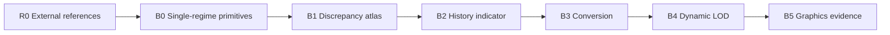

# Benchmark suite

## 1. Why a ladder

The final dynamic LOD combines several independently fragile components:

- exact event-driven dynamics;
- stochastic kinetic dynamics;
- paired ensemble comparison;
- collision-history statistics;
- conversion;
- online control;
- visualization.

A single final scene cannot diagnose which component failed. R0–B5 isolate them.

## 2. Suite map



## 3. R0 — External references

Reproduce documented DynamO, SPARTA, and uniGasFoam cases. The result is a
versioned oracle adapter, not merely a screenshot.

## 4. B0 — Single-regime primitives

Validate internal exact and kinetic backends independently against analytic,
statistical, or external reference behavior.

## 5. B1 — Discrepancy atlas

Run paired ensembles under matched physical definitions and map disagreement
across density, Knudsen regime, geometry, anisotropy, walls, resolution, and
future horizon.

## 6. B2 — History indicator

Test whether history features improve prediction beyond state-only and
finite-density baselines on grouped held-out cases.

## 7. B3 — Representation conversion

Test demotion, promotion, conservation, secondary statistics, interface flux,
and transient relaxation without dynamic policy confounds.

## 8. B4 — Dynamic LOD

Activate the online state machine, probes, hysteresis, budgets, and moving
partitions. Compare against uniform and state-only adaptive baselines.

## 9. B5 — Graphics evidence

Render the same physical artifacts with a shared pipeline and freeze three hero
scenes. No new physics should debut in B5.

## 10. Case lifecycle

```text
candidate -> smoke -> converged -> reviewed -> frozen -> evidence
                                  \-> retired with reason
```

## 11. Cross-suite invariants

All suites use:

- stable case and run IDs;
- declared units;
- immutable raw oracle output;
- seed families and uncertainty;
- explicit model-applicability labels;
- global and conversion-specific conservation budgets;
- renderer independence;
- no hidden manual cleanup.

## 12. Promotion rule

A later suite may begin engineering exploration before the previous suite is
fully complete, but it cannot become primary paper evidence until the preceding
exit gate passes.
