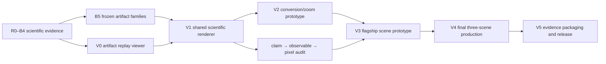

# Visual Production Roadmap

> 目标：把“算法通过后再做个好看视频”改造成一个从 M1 开始、受证据约束、可冻结、可复现的正式生产轨道。

本项目的 Demo 不是论文完成后的包装工作，而是一个只读的 **evidence client**：它读取与数值指标相同的 canonical artifacts，用统一的相机、显示密度和 transfer function，把已经成立的物理差异变成可理解的像素差异。

这条路线同时防止两个失败模式：

1. **Demo sinkhole**：过早投入资产、材质和镜头，算法一改全部返工；
2. **debug-view paper**：数值实验很严谨，但最终视频像内部调试器，reviewer 看不出贡献。

---

## 1. 两条并行但相互制约的轨道



### Scientific track

负责回答：

- 模型是否正确；
- history 是否有额外价值；
- conversion 是否守恒；
- dynamic LOD 是否改善 cost–quality Pareto frontier。

### Visual production track

负责回答：

- 这些差异能否在公平显示下被看见；
- 观众能否在几秒内理解画面；
- 微观粒子、宏观体积和表示分区是否形成统一视觉语言；
- 最终镜头是否能追溯到 frozen run、metric 和 renderer hash。

视觉轨道永远不能推翻科学轨道的边界。它只负责解释，不负责修正物理。

---

## 2. V0–V5 六级生产路线

## V0 — Artifact Replay Viewer

**时间位置：M1–M3。**

### 目的

尽早证明 canonical artifacts 真能被独立回放，避免到 M7 才发现输出格式不足以渲染。

### 最小能力

- 播放 exact particle bundle；
- 播放 kinetic display samples；
- 显示 density、temperature、species fraction；
- 显示 block ID 与 representation mask；
- 点击 block 查看 velocity histogram、stress、heat flux；
- 在时间窗口内显示 collision events；
- 读取 geometry bundle；
- 输出 deterministic render manifest。

### 不要求

- 电影级材质；
- 路径追踪；
- motion blur；
- 复杂相机 spline；
- 最终字幕和剪辑。

### Exit

同一 artifact 在两台机器上生成相同的 config hash、artifact hash 列表与 frame schedule；viewer 不调用 solver，也不改变任何状态。

---

## V1 — Shared Scientific Renderer

**时间位置：M3–M5。**

### 目的

建立所有 method 共用的正式 comparison renderer。

### 必须冻结的 comparison lock

- camera path；
- frame times；
- projection、FOV、near/far；
- geometry 与透明度；
- exact particle display radius；
- statistical display particle budget 与 seed；
- volume transfer function；
- tone mapping；
- temporal filter；
- image resolution；
- diagnostics placement。

### 主要输出

```text
render-manifest.json
frames/*.png or *.exr
comparison-lock.json
visual-metrics.json
contact-sheet.png
```

### Exit

full EDMD、full kinetic、state-only LOD、history/probe LOD 和 oracle upper bound 在同一 comparison group 中通过 lock audit；任意 method-specific override 都必须在 manifest 中显式列出并默认导致 primary comparison 失效。

---

## V2 — Conversion and Zoom Prototype

**时间位置：M5。**

### 目的

在投入旗舰场景前，单独解决最容易毁掉 SIG 视频的问题：popping、boiling、显示密度跳变和 camera–physics coupling。

### 原型镜头

```text
macro volume
→ statistical display particles
→ exact identities
→ collision trails
→ zoom back to macro volume
```

### 需要同时证明

- 相机只改变 display policy，不改变 physics representation；
- promotion/demotion 的物理时刻不依赖相机；
- species concentration 连续；
- volume integral 连续；
- statistical display particles 的 birth/death 具有 persistent identity 或共享的 temporal sampling；
- exact identity track 不被渲染层重采样；
- conversion frame 的视觉跳变不高于自然运动造成的典型 frame difference。

### Exit

`B5-ZOOM-MIX-v0` 通过 visual acceptance criteria，且 conversion continuity 在 neutral diagnostic render 与 hero-style render 中都成立。

---

## V3 — Flagship Scene Prototype

**时间位置：M6。**

第一优先只制作 **Expansion into Vacuum**，不同时铺开三个场景。

### 原因

它天然包含：

- 宏观体积；
- 微观粒子；
- moving transitional front；
- ballistic plume；
- dynamic exact/kinetic partition；
- zoom；
- clear silhouette；
- 速度方向和 species mixing。

### Flagship prototype 的问题

1. plume 本身是否具有清晰、稳定的视觉轮廓；
2. proposed method 相对 state-only/full kinetic 的差异是否不用看 mask 也能被辨认；
3. mask 和 diagnostic inset 是否增强解释，而不是淹没主画面；
4. 远景、近景和 velocity-space inset 是否使用同一份 frozen artifact；
5. exact fraction、cost 和 physical error 能否在一个镜头段落中讲明白。

### Exit

至少一个 15–25 秒的连续片段满足：

- 先只看 final render 就能观察到一个物理差异；
- 再显示 diagnostics 能解释差异来源；
- 最后显示 cost/partition 能解释方法价值。

若旗舰场景在 neutral comparison 中没有可见差异，停止 hero polish，返回 G6。

---

## V4 — Final Three-Scene Production

**时间位置：M7。**

三场景不平均分配职责。

| 场景 | 主要职责 | 视觉权重 |
|---|---|---:|
| Expansion into Vacuum | teaser、首页大图、大尺度动态 LOD、性能 | 最高 |
| Correlation Labyrinth | 核心 novelty、matched-state evidence、history graph | 科学最高 |
| Zoomable Mixing Chamber | 方法解释、conversion continuity、camera/physics separation | 教学最高 |

### 最终交付

- 30–45 秒 teaser；
- 3–5 分钟 method/result video；
- 每个 primary figure 的 reproducible frame recipe；
- supplementary failure reel；
- shot list 与 voice-over script；
- frozen render configs；
- render manifests；
- frame hashes；
- caption/legend source；
- comparison contact sheets。

---

## V5 — Evidence Packaging and Release

**时间位置：M7 收尾与投稿冻结。**

### 目的

把“本地能渲染”升级成“论文、视频和 artifact package 中的每一个像素都能被重新定位和重建”。

### 必须冻结

- paper figure / teaser / full-video 的 shot registry；
- 每个 shot 对应的 case ID、run IDs、claim IDs 和 metric artifact；
- render config、camera path、comparison lock、renderer implementation digest；
- source frame hashes、剪辑入点/出点和 caption 版本；
- neutral comparison 与 hero render 的对应关系；
- supplementary failure reel；
- 从 canonical artifacts 重建 primary figures 的命令。

### 发布包结构

```text
visual-evidence-release/
├── registry.json
├── manifests/
├── configs/
├── cameras/
├── frame-recipes/
├── contact-sheets/
├── failure-reel/
└── reproduce.md
```

### Exit

- primary figure 和 primary clip 的 evidence link 均为 complete；
- camera 文件内容哈希与 render manifest 一致；
- teaser 中不存在无法追溯到 frozen run 的插帧或手工数字；
- neutral render 与 hero render 不得得出相反结论；
- 从空的输出目录可以重建全部 primary contact sheets。

---

## 3. 与 M1–M7 的依赖映射

| Milestone | Visual deliverable | 禁止提前做的事 |
|---|---|---|
| M1 | V0 能回放 DynamO/SPARTA/uniGas canonical outputs | 不做 hero assets |
| M2 | exact/kinetic primitive diagnostic views | 不做方法专属美化 |
| M3 | discrepancy atlas、matched block viewer、difference view | 不隐藏 noise/convergence failure |
| M4 | state-only/history/probe score overlays | 不使用 oracle-only feature 做 online mask |
| M5 | V2 conversion/zoom prototype | 不把 temporal smoothing 当 conversion 修复 |
| M6 | V3 flagship vacuum prototype、Pareto overlays | 不扩展复杂 CAD/rigid-body coupling |
| M7 | V4 三场景 + V5 teaser/supplementary/evidence release | 不首次引入新物理 |

---

## 4. 数据流与不可越过的边界

```text
solver/adaptor
  ↓ canonical artifacts
metrics ───────────────┐
                       ├─ evidence ledger
renderer ─ manifest ───┘
```

Renderer：

- 不读 solver 内存；
- 不调用 partition policy；
- 不修正重叠、守恒或统计量；
- 不为 proposed method 删除“难看”粒子；
- 不用未来帧只平滑 proposed result；
- 不根据相机修改 physical representation。

---

## 5. Flagship-first 的投入规则

最终美术投入顺序固定为：

1. V0 viewer 数据完整；
2. V1 comparison lock 通过；
3. V2 zoom/conversion 镜头无 popping；
4. Expansion into Vacuum 在 neutral render 下有可见物理差异；
5. 才制作透明腔体、材质、灯光、motion blur 和最终剪辑；
6. 视觉语言稳定后，再迁移到 Labyrinth 与 Mixing。

这样可以避免三套场景同时返工。

---

## 6. 何时可以称为“SIG 级 Demo 路线已成立”

需要同时满足：

- **Scientific validity**：C3–C7 对应 gates 已通过；
- **Fair rendering**：comparison lock 完整；
- **Visible physics**：至少两个物理 observable 在不看 mask 时也可见；
- **Temporal quality**：conversion 与 display sampling 无明显 popping/boiling；
- **Narrative clarity**：每个 shot 只承担一个主要问题；
- **Production reproducibility**：每帧可追溯到 run、artifact、config、renderer version；
- **Bounded workload**：资产仍以 primitive geometry 为主，renderer 不演变为独立产品。

相关细节见：

- [Art direction](art-direction.md)
- [Storyboard](storyboard.md)
- [Visual acceptance criteria](visual-acceptance-criteria.md)
- [Claim-to-visual evidence matrix](claim-to-visual-evidence.md)
- [Scene specifications](scene-specs/README.md)
- [Demo production backlog](../roadmap/demo-production-backlog.md)
